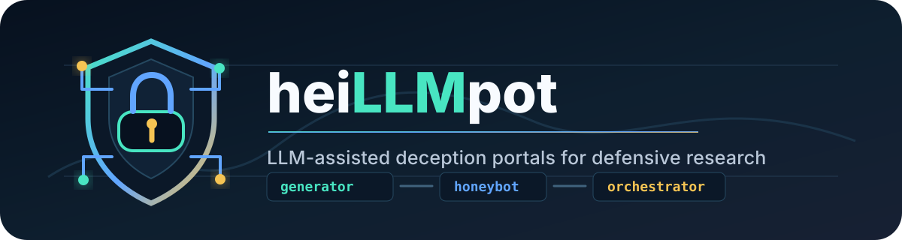
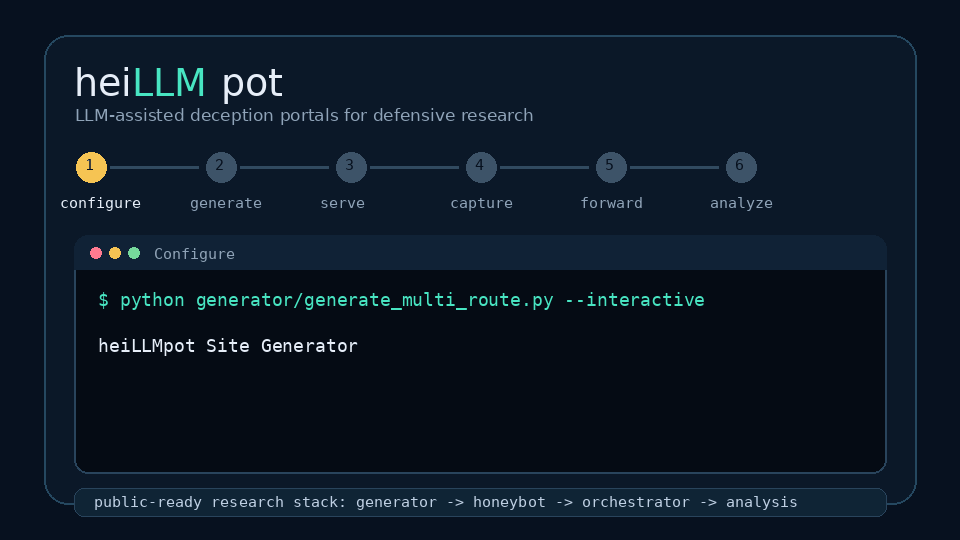
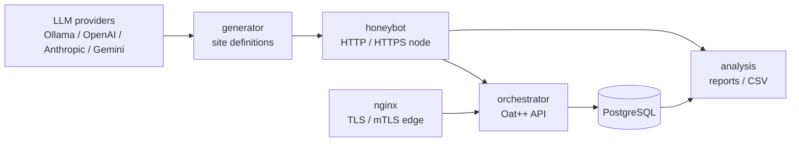

<p align="center">
  
</p>

<p align="center">
  LLM-assisted deception portals, a C++ honeybot runtime, and a central
  orchestrator for defensive honeypot research.
</p>

<p align="center">
  <a href="LICENSE"></a>
  
  
  
  
</p>

<p align="center">
  
</p>

## What Is heiLLMpot?

heiLLMpot is a research framework for generating believable fake web portals,
serving them through a honeypot node, and collecting structured events in a
central orchestrator. It is built for defensive experiments where the goal is
to study attacker behavior against realistic, context-aware application fronts.

The project combines:

- A multi-provider LLM generator for fake portals and SSH profiles
- A C++ HTTP/HTTPS honeybot runtime with generated-site rotation
- An Oat++ orchestrator API with PostgreSQL storage and JWT node auth
- A Dockerized React dashboard for live orchestrator telemetry
- An nginx TLS/mTLS edge for production-style central collection
- Local analysis scripts for JSONL logs and database summaries

> Safety note: run this only in isolated environments where you are authorized
> to collect traffic. Treat captured credentials, IPs, commands, and payloads as
> sensitive operational data.

## Highlights

- **Realistic site generation:** multi-agent prompts create app specs, UX plans,
  route HTML, and SSH environment profiles.
- **Provider support:** Ollama, OpenAI, Anthropic, and Google Gemini clients are
  supported through one CLI.
- **Public-facing polish:** generated pages get a site-wide HTML contract,
  stable layout rules, route-safe links, and stricter malformed HTML detection.
- **Interactive setup:** launch an `nmtui`-style terminal UI with
  `--interactive` to configure providers, contexts, models, and agent depth.
- **Central collection:** node events are forwarded to an orchestrator with
  PostgreSQL-backed sessions, events, credentials, HTTP requests, and stats.
- **Live dashboard:** inspect sessions, events, credentials, HTTP requests,
  nodes, and aggregates through a React UI backed by a small Express API.
- **Research-friendly analysis:** summarize local logs or run database analysis
  queries when you want offline reports.

## Architecture



More detail lives in [docs/architecture.md](docs/architecture.md).

## Quick Start

1. Create local config and secrets:

```bash
cp .env.example .env
openssl rand -hex 32
```

Put the generated value into `JWT_SECRET` in `.env`, and change `DB_PASSWORD`.

2. Generate local PKI and start the central stack:

```bash
make up NODE_ID=node-local-1
docker compose ps
curl http://localhost:8080/health
```

The orchestrator API binds to `127.0.0.1:8080` for local administration. Nginx
exposes HTTPS/mTLS on port `443`. The React dashboard is available at
`http://localhost:8090`.

3. Generate a fake site:

```bash
python3 -m venv .venv
. .venv/bin/activate
pip install requests tqdm
python generator/generate_multi_route.py \
  --provider ollama \
  --models llama3.2:3b \
  --count 1 \
  --context ai-company \
  --country US \
  --language English
```

Generated site JSON files go into `generated_sites/`.

4. Register a node and start the honeybot profile:

```bash
make register-node NODE_ID=node-local-1 NODE_API_KEY='replace-me'
docker compose --profile node up -d --build honeybot
```

HTTP is available on `http://localhost:8081`; HTTPS is available on
`https://localhost:8443`.

5. Analyze local logs:

```bash
make analyze HONEYPOT_LOG=honeybot/honeypot.log
```

Reports are written to `analysis/output/`.

## Generator

Built-in contexts include `university`, `hospital`, `bank`, `corporate`,
`government`, and `ai_company` with aliases such as `ai-company`,
`llm-provider`, and `model-provider`.

```bash
# Local Ollama
python generator/generate_multi_route.py --provider ollama --models llama3.2:3b

# OpenAI
OPENAI_API_KEY=... python generator/generate_multi_route.py \
  --provider openai --models gpt-5-mini --context ai-company

# Anthropic
ANTHROPIC_API_KEY=... python generator/generate_multi_route.py \
  --provider anthropic --models claude-sonnet-4-5 --context ai-company

# Google Gemini
GEMINI_API_KEY=... python generator/generate_multi_route.py \
  --provider google --models gemini-2.5-flash --context ai-company
```

Use `--agent-depth basic`, `standard`, or `deep` to control generation quality.
`standard` adds a UX/product architect pass; `deep` also adds a final realism QA
agent.

For a guided terminal UI:

```bash
python generator/generate_multi_route.py --interactive
```

See [docs/generator.md](docs/generator.md) for provider configuration, context
authoring, and quality controls.

## Repository Layout

```text
generator/       LLM clients, contexts, prompts, TUI, and site pipeline
honeybot/        C++ HTTP/HTTPS honeypot runtime
orchestrator/    C++ Oat++ API, auth, controllers, database client, worker
dashboard/       Next.js live telemetry UI and server-side snapshot API
nginx/           TLS/mTLS reverse proxy configuration
analysis/        SQL and local log analysis outputs
scripts/         PKI, node registration, and log analysis helpers
docs/            Public-facing docs and project assets
```

## Useful Commands

```bash
make up              # build and start postgres, orchestrator, nginx
make dashboard       # build and start only the React dashboard
make up-node         # build and start the optional honeybot profile
make logs            # follow Docker Compose logs
make db-shell        # open psql inside the Postgres container
make db-analysis     # run SQL analysis queries
make down            # stop the stack
```

## Public Release Notes

Before publishing a fork or release, check
[docs/public-release-checklist.md](docs/public-release-checklist.md). The short
version:

- Do not commit `.env`, certificates, logs, or generated site JSON.
- Rotate any credentials that were ever used in a local run.
- Review generated sites before sharing them as examples.
- Keep the safety language intact if you redistribute the project.

## Contributing

Issues, docs fixes, generator contexts, and focused runtime improvements are
welcome. Start with [CONTRIBUTING.md](CONTRIBUTING.md), and please keep changes
small enough to review. Community expectations are in
[CODE_OF_CONDUCT.md](CODE_OF_CONDUCT.md).

## Security

This is defensive research software, but it still handles sensitive telemetry.
Read [SECURITY.md](SECURITY.md) before exposing it to real traffic or reporting
a vulnerability.

## License

MIT. See [LICENSE](LICENSE).
