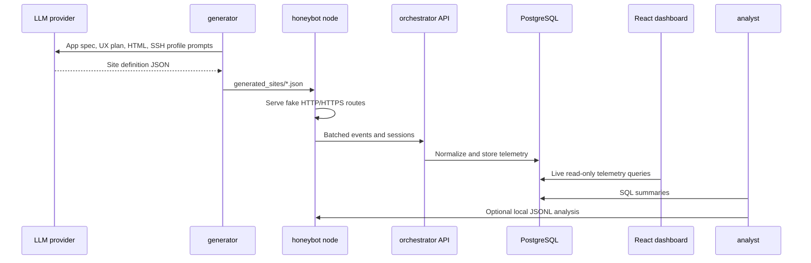

# Architecture

heiLLMpot is split into four cooperating layers: generation, node runtime,
central orchestration, and analysis.

## Data Flow

## Components

### Generator

The Python generator creates complete site definition JSON files. It supports
multiple LLM providers, reusable deployment contexts, a terminal UI, and a
multi-agent pipeline:

- App specification agent
- UX/product architect agent
- Route HTML generation agent
- Critic/revision agent
- Optional realism QA agent
- SSH profile agent

Generated HTML is post-processed with a deterministic contract that keeps links
inside known routes, injects responsive layout guard CSS, and rejects truncated
or unbalanced markup.

### Honeybot

The C++ honeybot serves generated sites over HTTP and HTTPS. It records
structured request events, session metadata, credentials, HTTP request details,
and honeypot protocol events. Orchestrator forwarding is asynchronous and can be
disabled for local-only experiments.

SSH support is scaffolded in the runtime but disabled by default.

### Orchestrator

The C++ Oat++ orchestrator exposes health, node registration, event ingestion,
session, and stats endpoints. PostgreSQL stores normalized telemetry. Node auth
uses JWTs, and nginx can provide a TLS/mTLS edge in front of the API.

### Dashboard

The dashboard is a Dockerized React app with a small Node/Express API in the
same container. The browser talks to the dashboard API, and the dashboard API
reads PostgreSQL directly inside the Compose network. It shows live sessions,
events, credentials, HTTP requests, nodes, classifications, and aggregate
counts. Credentials are redacted by default and can be exposed only by setting
`DASHBOARD_REDACT_SECRETS=false`.

### Analysis

Local analysis scripts read JSONL logs and write Markdown, JSON, and CSV
summaries. Database analysis queries live in `analysis/summary.sql` and cover
top IPs, requested paths, credentials, user agents, daily stats, and command
events.

## Trust Boundaries

- LLM-generated site files are untrusted content. Review generated examples
  before publishing or deploying them.
- The honeybot should run in an isolated network segment.
- The orchestrator should not be exposed without TLS, authentication, and secret
  rotation.
- Captured traffic can contain sensitive data, even when the site itself is
  fake.

## Local Ports

| Service | Default binding | Notes |
| --- | --- | --- |
| Orchestrator API | `127.0.0.1:8080` | Local admin/API access |
| Nginx HTTP | `0.0.0.0:80` | Redirect/proxy layer |
| Nginx HTTPS | `0.0.0.0:443` | TLS/mTLS edge |
| Dashboard | `127.0.0.1:8090` | React live telemetry UI |
| Honeybot HTTP | `0.0.0.0:8081` | Optional node profile |
| Honeybot HTTPS | `0.0.0.0:8443` | Optional node profile |
| Honeybot SSH | `0.0.0.0:2222` | Disabled by default |
